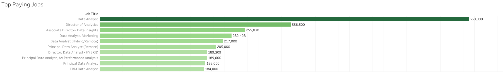
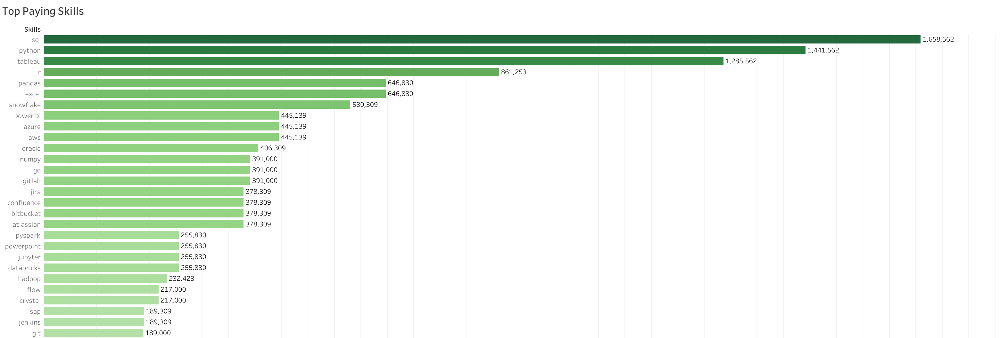
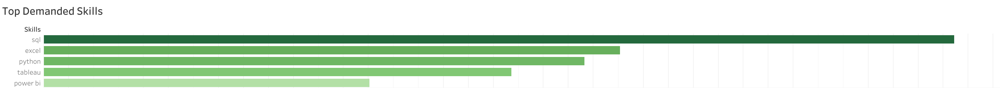
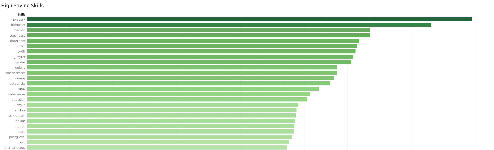
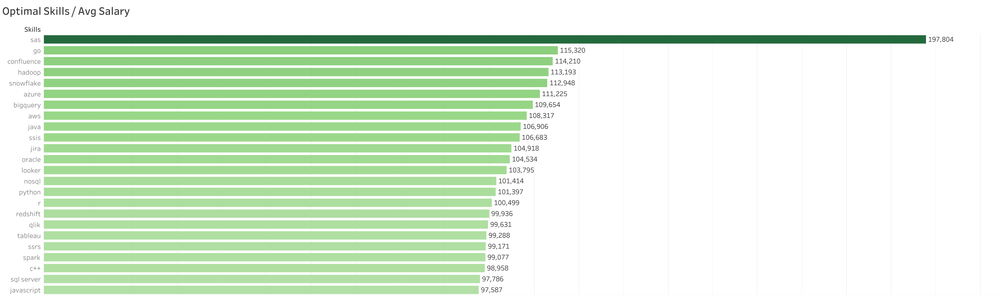

# Data Job Market Analysis — SQL Project

📊 Dive into the data job market! Focusing on data analyst roles, this project explores 💰 top-paying jobs, 🔥 in-demand skills, and 📈 where high demand meets high salary in data analytics.

🔍 SQL queries? Check them out here: [project_sql folder](project_sql/)

---

# Background

This project was born from a desire to better understand the data analyst job market — what pays well, what skills are most valued, and where to focus learning efforts for maximum career impact.

Data is sourced from [Luke Barousse](https://github.com/lukebarousse) of his excellent [SQL Course YT video](https://youtu.be/7mz73uXD9DA?si=ppnVm-HJi70YCJFz), covering job postings from December 2022 to December 2023. It includes details on job titles, salaries, locations, and required skills.

### The questions I wanted to answer through my SQL queries:

1. What are the top-paying data analyst jobs?
2. What skills are required for these top-paying jobs?
3. What skills are most in demand for data analysts?
4. Which skills are associated with higher salaries?
5. What are the most optimal skills to learn?

---

# Tools I Used

For my deep dive into the data analyst job market, I harnessed the power of several key tools:

- **SQL** — The backbone of my analysis, allowing me to query the database and unearth critical insights.
- **PostgreSQL** — The chosen database management system, ideal for handling the job posting data.
- **Visual Studio Code** — My go-to for database management and executing SQL queries.
- **Tableau** — Used to create clear, compelling visualizations from query results.
- **Git & GitHub** — Essential for version control and sharing my SQL scripts and analysis.

---

# The Analysis

Each query targets a specific aspect of the data analyst job market. Here's how I approached each question:

---

### 1. Top Paying Data Analyst Jobs

To identify the highest-paying roles, I filtered data analyst positions by average yearly salary and location, focusing on remote jobs. This query highlights the top earning opportunities in the field.

```sql
SELECT
    job_id,
    job_title,
    job_location,
    salary_year_avg,
    job_posted_date,
    name AS company_name
FROM
    job_postings_fact
LEFT JOIN company_dim ON job_postings_fact.company_id = company_dim.company_id
WHERE
    job_title_short = 'Data Analyst' AND
    job_location = 'Anywhere' AND
    salary_year_avg IS NOT NULL
ORDER BY
    salary_year_avg DESC
LIMIT 10;
```

#### Key Findings:

- **Wide Salary Range:** Top 10 roles span from $184,000 to $650,000, indicating significant earning potential in the field.
- **Diverse Employers:** Companies like SmartAsset, Meta, and AT&T are among those offering top salaries, showing broad interest across industries.
- **Job Title Variety:** Titles range from Data Analyst to Director of Analytics, reflecting varied specializations within the field.


_Horizontal bar chart showing the top 10 highest-paying remote Data Analyst roles in 2023._

---

### 2. Skills Required for Top-Paying Jobs

Building on the previous query, I joined the skills data to identify what skills the highest-paying roles require.

```sql
WITH top_paying_jobs AS (
    SELECT
        job_id,
        job_title,
        salary_year_avg,
        name AS company_name
    FROM
        job_postings_fact
    LEFT JOIN company_dim ON job_postings_fact.company_id = company_dim.company_id
    WHERE
        job_title_short = 'Data Analyst' AND
        job_location = 'Anywhere' AND
        salary_year_avg IS NOT NULL
    ORDER BY
        salary_year_avg DESC

    LIMIT 10
)

SELECT
    top_paying_jobs.*,
    skills_dim.skills as skills
FROM top_paying_jobs
INNER JOIN skills_job_dim ON top_paying_jobs.job_id = skills_job_dim.job_id
INNER JOIN skills_dim ON skills_job_dim.skill_id = skills_dim.skill_id

ORDER BY
    salary_year_avg DESC;your query here
```

#### Key Findings:

- **SQL and Python** dominate the top-paying roles, appearing in the majority of listings.
- **Cloud and big data tools** like Snowflake and Azure are increasingly present at higher salary tiers.
- **Visualization skills** (Tableau, Power BI) complement technical skills across top roles.


_Horizontal Bar chart showing the most common skills across the top 10 highest-paying Data Analyst roles._

---

### 3. Most In-Demand Skills for Data Analysts

This query identifies the skills that appear most frequently across all Data Analyst job postings, regardless of salary.

```sql
SELECT 
    skills, 
    COUNT(job_postings_fact.job_id) AS demand_count 
FROM 
    job_postings_fact 
INNER JOIN 
    skills_job_dim ON job_postings_fact.job_id = skills_job_dim.job_id 
INNER JOIN 
    skills_dim ON skills_job_dim.skill_id = skills_dim.skill_id 
WHERE 
    job_title_short = 'Data Analyst' 
    AND job_work_from_home IS TRUE 
GROUP BY 
    skills 
ORDER BY 
    demand_count DESC 
LIMIT 5;

```

#### Key Findings:

- **SQL** is the single most requested skill, appearing in the vast majority of postings.
- **Excel** remains highly relevant despite the rise of more advanced tools.
- **Python, Tableau, and Power BI** round out the top 5 most in-demand skills.


_Horizontal Bar chart showing the top 5 most in-demand skills for Data Analysts._

---

### 4. Top Skills Based on Salary

Here I looked at average salaries associated with each skill to find which skills are the highest-paying — not just the most common.

```sql
SELECT 
     skills,
     ROUND(AVG(salary_year_avg), 0) AS avg_salary
FROM
     job_postings_fact
INNER JOIN skills_job_dim ON job_postings_fact.job_id = skills_job_dim.job_id
INNER JOIN skills_dim ON skills_job_dim.skill_id = skills_dim.skill_id
WHERE 
    job_title_short = 'Data Analyst' 
    AND salary_year_avg IS NOT NULL
    AND job_work_from_home IS TRUE
GROUP BY
     skills
ORDER BY
     avg_salary DESC
LIMIT 25;
```
#### Key Findings:

- **Niche and specialized tools** (e.g., PySpark, Bitbucket, Watson) command the highest average salaries.
- Skills associated with **big data, ML engineering, and cloud platforms** correlate with higher pay.
- There's a clear premium on skills that go beyond standard analyst tools.


_Horizontal bar chart showing the top skills ranked by average yearly salary._

---

### 5. Most Optimal Skills to Learn

Combining demand and salary data, this query surfaces the sweet spot — skills that are both highly sought after and well-compensated.

```sql
SELECT skills_dim.skill_id,
  skills_dim.skills,
  COUNT (skills_job_dim.job_id) AS demand_count,
  ROUND (AVG(job_postings_fact.salary_year_avg), 0) AS avg_salary
FROM job_postings_fact
  INNER JOIN skills_job_dim ON job_postings_fact.job_id = skills_job_dim.job_id
  INNER JOIN skills_dim ON skills_job_dim.skill_id = skills_dim.skill_id
WHERE job_title_short = 'Data Analyst'
  AND salary_year_avg IS NOT NULL
  AND job_work_from_home IS true
GROUP BY skills_dim.skill_id
HAVING COUNT (skills_job_dim.job_id) > 10
ORDER BY avg_salary DESC,
  demand_count DESC
LIMIT 25;
```

#### Key Findings:

- **SQL and Python** offer the best combination of high demand and strong salaries — ideal starting points.
- **Tableau** stands out as the top visualization skill by both demand and pay.
- **Cloud skills** (Snowflake, Azure) are increasingly optimal as the market shifts toward cloud-based analytics.


_Horizontal bar showing skills by demand (x-axis) vs. average salary (y-axis). Top-right = most optimal._

---

# What I Learned

Throughout this project, I significantly leveled up my SQL skills:

- 🧩 **Complex Queries** — Became comfortable writing multi-table JOINs and WITH clauses (CTEs) for cleaner, more readable logic.
- 📊 **Aggregations** — Used GROUP BY, COUNT, and AVG extensively to derive meaningful summaries from raw data.
- 💡 **Analytical Thinking** — Learned to translate real business questions into precise SQL queries and interpret the results meaningfully.

---

# Conclusions

### Insights

1. **Top-paying Data Analyst roles** go up to $650,000 for remote positions, with significant variation by title and company.
2. **SQL is non-negotiable** — it appears in both the highest-paying and most in-demand skills lists.
3. **Python and cloud tools** are increasingly tied to higher salaries and are worth prioritizing.
4. **Tableau and Power BI** are the most valued visualization tools in the job market.
5. **The most optimal skills** — SQL, Python, and Tableau — offer the best return on learning investment for aspiring analysts.

### Closing Thoughts

This project strengthened my SQL skills while delivering real, actionable insights about the data analyst job market. The findings make it clear where to focus: SQL first, Python second, then visualization. For anyone breaking into data analytics, this analysis provides a data-driven roadmap for skill development — which feels fitting.
